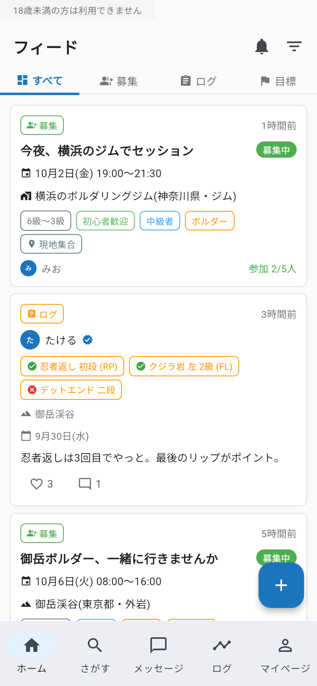
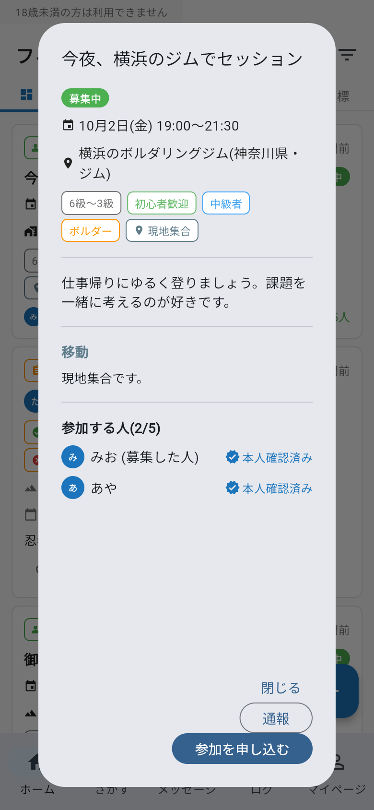
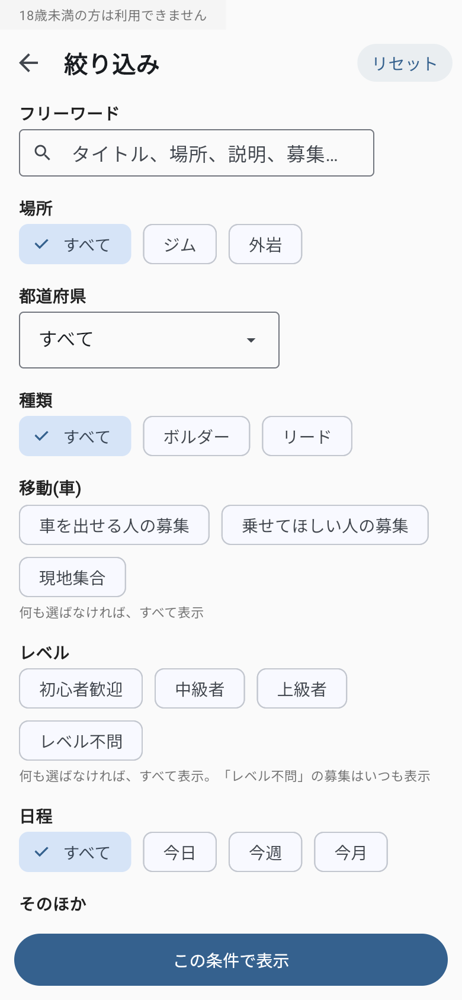
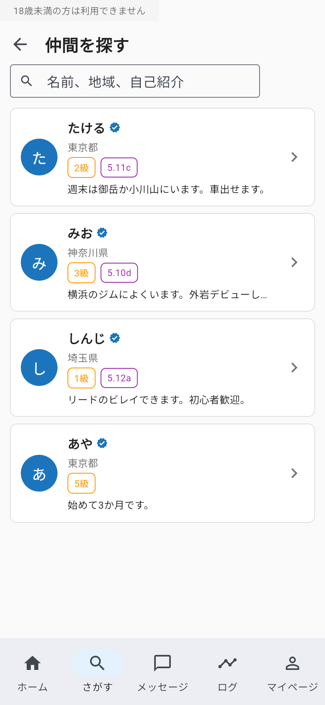
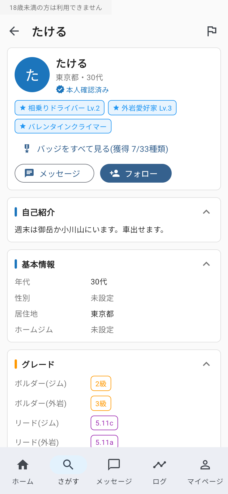
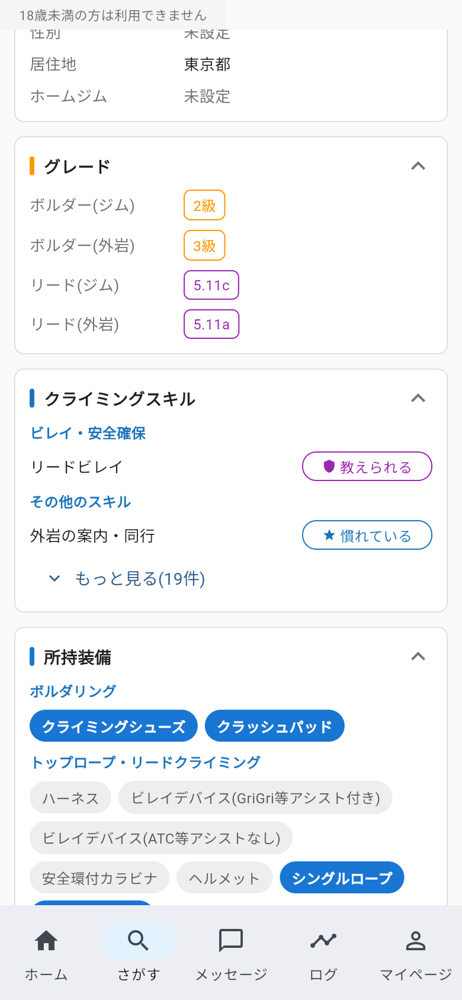
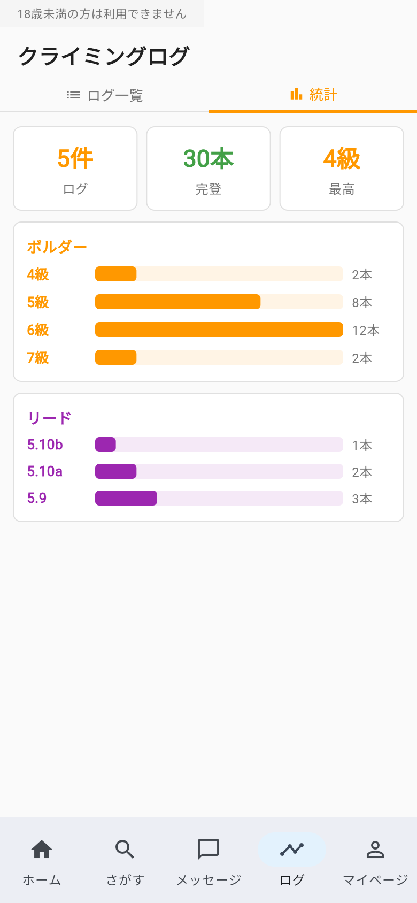
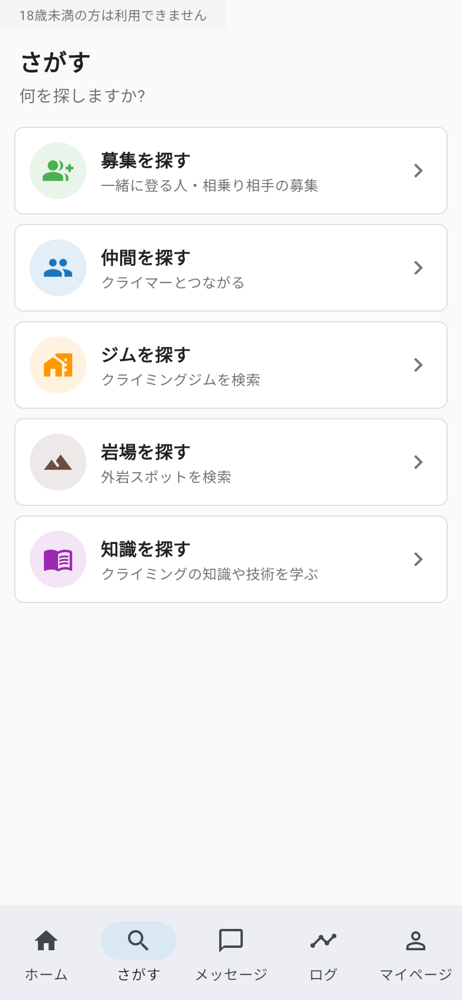

# Mirai Climbing への意見

クライミングの仲間と、岩場への相乗り相手を探せるアプリ「Mirai Climbing」を作り直しています。
ここは、アプリやニュースのサイトへの意見を書いてもらう場所です。

## いまの試作(2026年10月)
まだ公開していないので、画面の写真で紹介します。写っている人や募集は、すべて架空のデータです。

| | |
|:-:|:-:|
|  **フィード**:募集・ログ・目標が新しい順に並ぶ |  **募集**:日時、場所、レベル、移動(車・現地集合)。参加する人は全員本人確認済み |
|  **募集の絞り込み**:ジム/外岩、都道府県、ボルダー/リード、車、レベル、日程 |  **仲間を探す**:名前・地域・自己紹介で探せる |
|  **プロフィール**:年代(本人確認から自動)、居住地、ホームジム、グレード、バッジ |  **スキルと装備**:ビレイなどのスキルの段階、持っている装備 |
|  **ログの統計**:グレードごとの完登本数 |  **さがす**:募集、仲間、ジム、岩場、知識 |

### 試作でできること
- **仲間・相乗りの募集**:一緒に登る人や、岩場へ車で行く相手を募集・応募できます。
- **ログ**:登った記録を投稿できます(ジムは「グレード × 本数」、外岩は課題ごとに完登・敗退)。
- **プロフィール**:グレード(ボルダー・リード × ジム・外岩)、スキル、装備、クライミングスタイル、活動できる日時など。
- **メッセージ**:1対1で送れます。
- **安全**:募集・応募・メッセージをする人は、全員、身分証で本人確認をします。ブロック・通報もできます。

### まだないもの(意見をもとに考え中)
- どんな仲間が欲しいか(同じくらいのグレード、自分より強い人、ビレイヤー、スポットなど)
- やりたいルート・課題、行きたいエリア
- 日程の調整(調整さんやカレンダーのような機能)
- ビレイを安心して頼めるようにする仕組み

## 書き方
上の「Discussions」から書けます(GitHub のアカウントが要ります)。
「New discussion」を押して、近いカテゴリを選んでください。

- **Ideas**:欲しい機能、あったらいい項目(例:仲間探しで知りたいこと、日程の調整)
- **Q&A**:分からないこと、聞きたいこと
- **General**:そのほか何でも(安全のこと、ニュースのサイトへの要望など)

すでに同じ話があれば、そこにコメントや👍をもらえると助かります。

## お願い
- ここは誰でも読めます。**本名、電話番号、住所、メールアドレスなどは書かないでください。**
- 人を傷つける書き込み、宣伝、出会いを目的にした書き込みは消します。
- アプリは18歳以上の方が対象です。

## 関連
- クライミングニュース(毎朝 AI がまとめています):https://news.mirai-climbing.com/
